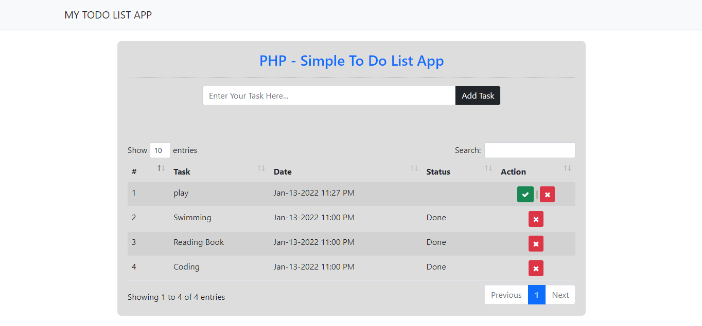
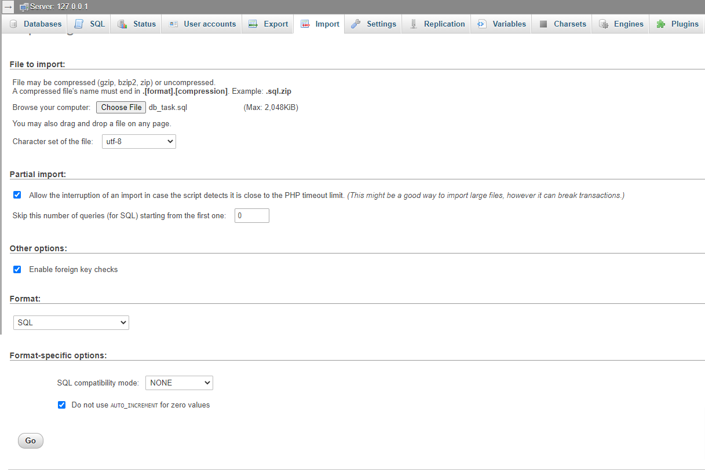

# Creating a Simple To Do List App in PHP

<b>Body</b>

In this tutorial we will create a <b>Simple To-Do List App</b> using <b>PHP</b>. <b>PHP</b> is a server-side scripting language designed primarily for web development. Using PHP, you can let your user directly interact with the script and easily to learned its syntax. It is mostly used by newly coders for its user-friendly environment.

### So Let's do the coding...
## Getting started:

First you have to download & install XAMPP or any local server that run PHP scripts. Here's the link for XAMPP server <a target="_blank" href="https://www.apachefriends.org/index.html">https://www.apachefriends.org/index.html</a>.

And this is the link for the bootstrap that has been used for the layout <a target="_blank" href="https://getbootstrap.com/">https://getbootstrap.com/</a>.

## Creating Database

Open your database web server then create a database name in it <code>db_task</code>. After that, click <code>Import</code> then locate the database file inside the folder of the application then click ok.

## Creating the Database Connection
Open your any kind of text editor(notepadd++, etc..). Then just <b>copy/paste</b> the code below then name it <b>conn.php</b>.

<pre>
<code>
$conn = new mysqli("localhost", "root", "", "db_task");

if(!$conn){
    die("Error: Cannot connect to the database");
}
</code>
</pre>

<b>Note: Start PHP Opening and Closing tag</b>

## Creating The Interface

This is where we will create a simple form for our application. To create the forms simply <b>copy</b> and <b>paste</b> it into you text editor, then save it as shown below.

<a target="_blank" href="https://github.com/Sujon-Ahmed/PHP-TODO-LIST/blob/main/index.php">Index Page</a>

<b>add_query.php</b>
<pre>
<code>
require_once 'conn.php';
if(isset($_POST['add'])){
if($_POST['task'] != ""){
    $task = $_POST['task'];

    $conn->query("INSERT INTO `task` (`task`)VALUES('$task')");
    header('location:index.php');
}
}
</code>
</pre>

<b>update_task.php</b>
<pre>
<code>
require_once 'conn.php';
if($_GET['task_id'] != ""){
    $task_id = $_GET['task_id'];

    $conn->query("UPDATE `task` SET `status` = 'Done' WHERE `task_id` = $task_id") or die(mysqli_errno($conn));
    header('location: index.php');
}
</code>
</pre>

<b>delete_query.php</b>
<pre>
<code>
require_once 'conn.php';
if($_GET['task_id']){
    $task_id = $_GET['task_id'];

    $conn->query("DELETE FROM `task` WHERE `task_id` = $task_id") or die(mysqli_errno($conn));
    header("location: index.php");
}	
</code>
</pre>

There you have it we successfully created a Simple To-Do List <b>App</b> using <b>PHP</b>. I hope that this simple project helps you to what you are looking for. For more updates and projects just kindly visit my profile. 
<a target="_blank" href="https://github.com/Sujon-Ahmed">Sujon-Ahmed</a>

<b>Enjoy Coding!!!</b>
